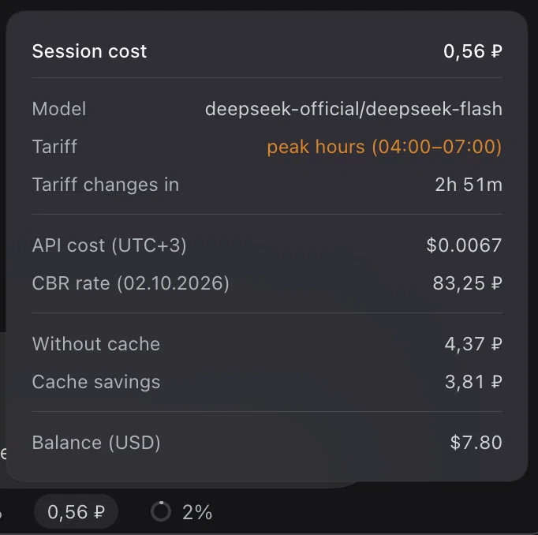

# dsh-rub-cost

A DeepSeek Harness plugin: it shows the cost of the current session in rubles in
the conversation dock, next to the built-in token counters
(`conversation.composer.dock`).

The pill is a button. Clicking it opens a card styled after the built-in "Token
usage" popover; a second click, a click outside the card, or Escape closes it.

## Installation

Published on npm as [`@stmol/dsh-rub-cost`](https://www.npmjs.com/package/@stmol/dsh-rub-cost).
Any DSH bundle source works: an npm package, a Git repository, a tarball, or a
local folder.

* **GUI:** Settings → Plugins → Add plugin, then `@stmol/dsh-rub-cost`, or the
  [repository](https://github.com/Stmol/dsh-rub-cost) address.
* **CLI:** `dsh plugin add @stmol/dsh-rub-cost`.

The install name is the `name` field in `package.json`; the `name` in
`cordis.patch.yml` and the factory `id` in `client.js` have to match it, or the
bundle will not build. There are no automatic updates: remove the plugin and add
it again. The plugin runs with your own privileges.

## What the card shows

Model, the current tariff and the countdown to its switch, the API cost in
dollars at the tariff in effect (the card names your browser's UTC offset, and
falls back to UTC+3 without one), the CBR rate with its publication date, the
cost of the session including subagents, the same session without a cache and
the savings, and the DeepSeek Platform wallet balances.

Every amount except the API cost is shown with two decimals; the API cost keeps
four. The token breakdown stays out of the card, because the neighbouring "Token
usage" cell already prints it.

Peak hours cost twice the off-peak rate. The tariff row names only the window in
effect, for example `peak hours (04:00-07:00)` highlighted in amber, or
`off-peak`. Peak hours are Beijing weekdays 09:00-12:00 and 14:00-18:00, printed
in your browser's timezone — 04:00-07:00 and 09:00-13:00 at UTC+3, and the same
windows shifted by the offset the card names; weekends are off-peak around the
clock. The tariff itself is never computed in your zone: the rule stays in
Beijing time, and only the printed clock moves, so the cost is the same wherever
the card is opened. The countdown follows from that rule alone, so on a Friday it
runs into the next week: `63h 00m` just after 13:00 MSK, `61h 47m` at 14:13 MSK.
The rule assumes the following Monday is an ordinary working day; a PRC holiday
moves the real switch, as the first limitation below explains.

## How it is computed

`cost = (uncachedInput + cacheWrite) × cacheMiss + cacheRead × cacheHit + output × output`

Tokens are priced with DeepSeek's official dollar list per 1M tokens, then
converted at the CBR USD/RUB rate. The account is billed in dollars, so the
dollar list is the basis; the yuan list on the Chinese documentation page is the
same list at the fixed 20/3 ¥/$ rate. A usage report can show amounts in CNY
while a granted yuan balance is being spent, which is that same list again.

Tokens come from the host `tokenUsage` projection and the model from
`modelSelection.lastUsed`; the plugin never folds the session journal itself. The
rate comes from a mirror of the CBR rates and is cached in `localStorage`: with
no network the last known rate is used, and with no cache the cell shows a dash
and the reason in the tooltip.

The amount is the cost of the current session, not of the account. Subagents are
priced from their own route and summed into a separate "Total with subagents"
row; while the card is open their spend is polled every 15 seconds. If even one
child cannot be read, that row is hidden rather than shown incomplete.

## Known limitations

* PRC statutory holidays are not modelled. The plugin keeps one year-agnostic
  rule — Beijing weekday plus peak window — so it needs no annual edit, and a
  holiday weekday is therefore priced as a peak day. DeepSeek bills those days at
  the off-peak rate, so on such a day the amount and the countdown are both too
  high until the holiday is over. The official dates live in the State Council
  notice published every November, which is the only source; the client bundle
  ships no year-specific table on purpose.
* `tokenUsage` holds a whole-session total with no per-route split, so after a
  mid-session model change everything is estimated with the last used model.
* Cache writes are billed at the cache miss rate: DeepSeek publishes no separate
  price, and on DeepSeek routes that counter is zero anyway.
* Subagents use their own last used model at the current tariff, and a child that
  has not chosen a route yet falls back to the parent's.
* The balance request pins `x-client-version`. The version is hardcoded in
  `client.js` and has to be updated by hand after a DSH upgrade.
* The clock zone comes from the browser, not from the DeepSeek account: the
  account profile (`remote.account.getProfile`) exposes no timezone. When the
  browser reports no zone at all, the card falls back to `DEFAULT_OFFSET_MS`
  (UTC+3).

## Editing prices and the rate

`MODEL_PRICES`, `BILLING_CURRENCY` and `RATE_URL` sit at the top of `client.js`;
`DEFAULT_OFFSET_MS` next to them is the fallback clock offset (UTC+3) for a
browser that reports none. After an edit the bundle has to be reinstalled: remove
and add the plugin in the UI, or `dsh plugin add <path-to-plugin-directory>`.

## License

MIT, see [LICENSE](LICENSE).

